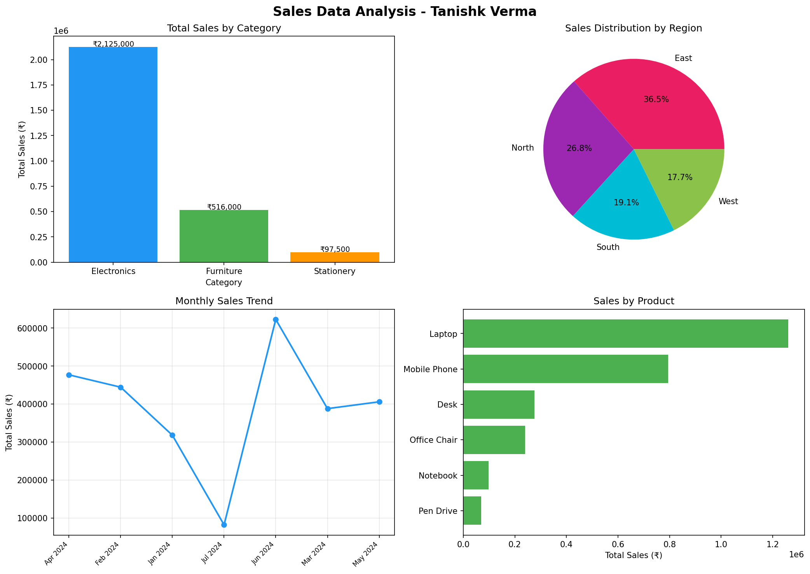

# Sales-Data-Analysis
📌 Project Overview
Analysis of 50 sales transactions across different product categories, regions, and months to extract key business insights.
🎯 Key Insights

💰 Total Revenue: ₹24,85,500
🏆 Best Category: Electronics
🌍 Best Region: North
📦 Top Product: Laptop

📊 Visualizations

Sales by Category (Bar Chart)
Sales by Region (Pie Chart)
Monthly Sales Trend (Line Chart)
Sales by Product (Horizontal Bar)

🛠️ Tools Used

Python
Pandas
Matplotlib

🚀 How to Run
bashpip install pandas matplotlib
python sales_analysis.py
👨‍💻 Author
Tanishk Verma — Data Analyst

